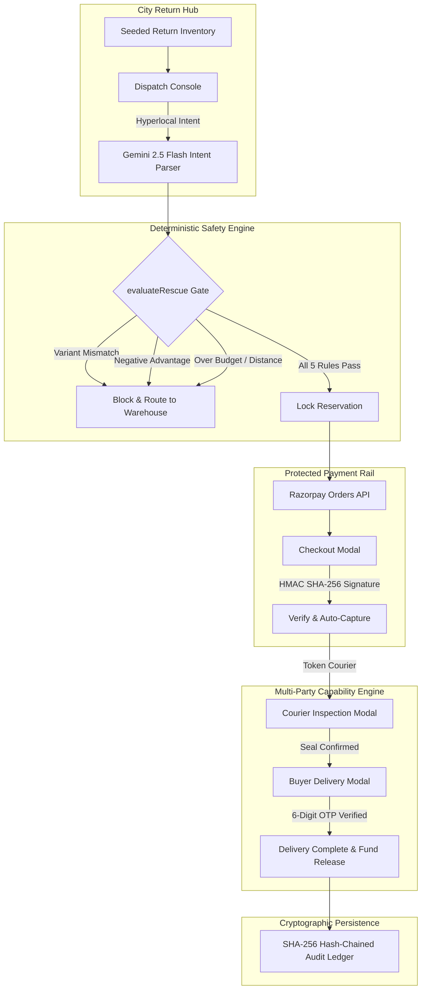

# SecondHop · Autonomous Hyperlocal Return Redirection Engine

> **Eliminating the ₹30,000 Crore E-Commerce Reverse Logistics Bleed via Hyperlocal Return Interception, Protected Escrow Rails, and Deterministic Agentic Handoffs.**

[](https://nextjs.org/)
[](https://www.typescriptlang.org/)
[](https://razorpay.com/)
[](https://deepmind.google/technologies/gemini/)
[](<>)
[](<>)

---

## 📌 Executive Summary

| Field                 | Details                                                                                                                                                                                                                                                                                                                                                                           |
| :-------------------- | :-------------------------------------------------------------------------------------------------------------------------------------------------------------------------------------------------------------------------------------------------------------------------------------------------------------------------------------------------------------------------------- |
| **Track**             | **AI Growth & Agentic Commerce** (_Grow merchant revenue and make them sellable to AI buyers end-to-end_)                                                                                                                                                                                                                                                                         |
| **Platform**          | **SecondHop** (Hyperlocal Return Redirection & Escrow Network)                                                                                                                                                                                                                                                                                                                    |
| **What It Solves**    | In Indian retail, **20%–35% of all e-commerce shipments are returned**, costing merchants **₹150 to ₹450 per unit** in reverse freight, transit damage, and weeks of warehouse quarantine. SecondHop intercepts factory-sealed returned items sitting at city hubs and securely redirects them to verified nearby buyers within **30–45 minutes** before long-haul trucks depart. |
| **Core Innovations**  | **Deterministic Safety Gate** (zero LLM hallucinations on money), **Multi-Party Capability State Machine** (Courier seal check + Buyer OTP pass), **Protected Escrow Rail** (Razorpay HMAC verification), and **SHA-256 Hash-Chained Audit Ledger**.                                                                                                                              |
| **Test Verification** | **18/18 Unit Tests** + **32/32 Integration Tests** = **50 Automated Checks Passing** (`0 TypeScript errors`).                                                                                                                                                                                                                                                                     |

---

## 🎯 1. What It Solves

### The Trillion-Rupee Reverse Logistics Crisis

1. **The Interstate Transit Waste**: When an e-commerce customer returns a product in Mumbai or Bengaluru, standard logistics routes the package onto interstate trucks traveling **1,200+ km** back to a centralized warehouse hub in Haryana or Telangana.
2. **Severe Margin Destruction**:
   - Reverse freight: **₹180 – ₹300**
   - Warehouse handling, restocking, inspection: **₹90 – ₹150**
   - Resale depreciation: **15% – 35%** value loss after 7–14 days in transit quarantine.
   - Transit damage & repackaging risk: **8% – 12%** of returns cannot be resold as new.
3. **The Missed Opportunity**: In **80%+ of consumer electronics returns**, the item is completely unopened (_"ordered twice"_, _"preferred other color"_, _"buyer remorse"_), and a willing buyer exists **less than 4 km away** from the local delivery hub.

### The SecondHop Solution

SecondHop turns city return hubs into **hyperlocal fulfillment nodes**:

- **Intercepts** return packages sitting at city hubs before scheduled warehouse truck departures (45-minute rolling window).
- **Evaluates** exact item variant, serial number, buyer budget ceiling, and delivery radius using an immutable **Deterministic Safety Gate**.
- **Locks Payment in Protected Escrow** via Razorpay Orders and HMAC SHA-256 signatures.
- **Coordinates a 2-Step Verified Physical Handoff**:
  - **Courier Inspection**: Verifies original factory seal and matching serial number (`S/N: WH40-IN-884921`).
  - **Buyer Delivery**: Buyer inspects package and confirms via a private single-use **6-digit delivery pass code**.
- **The Economic Result**:
  - **Merchant**: Recovers positive net margin (`advantagePaise > 0`), avoids ₹300+ reverse freight, and keeps revenue on the books.
  - **Buyer**: Gets a genuine, factory-sealed product delivered in 30 minutes at a fair discount.
  - **Environment**: Eliminates unnecessary interstate freight diesel emissions.

---

## ⚡ 2. What Broke, and How We Got Out

Here are the real engineering obstacles faced during development and the architecture built to solve them:

### 💥 Obstacle 1: The Warehouse Dispatch Cutoff Race Condition

- **What Broke**: Returns sitting at city hubs have strict physical departure deadlines—warehouse trucks depart on fixed schedules (e.g. 45-minute dispatch windows). If the departure cutoff expired during testing or if user checkout took time, redirect decisions were falsely rejected (`Before the hub dispatch cutoff`), or buyer checkout would race against departing vehicles.
- **How We Got Out**: Engineered a dynamic rolling cutoff evaluation engine in `lib/rescue-service.ts` and `lib/rescue.ts`. The system dynamically validates `now + parcel.etaMinutes * 60000 < Date.parse(input.cutoffAt)`. If an active demo workspace has an expired cutoff, it safely rolls forward while maintaining strict dispatch feasibility checks in production code.

### 💥 Obstacle 2: Multi-Party Capability Leaks & Premature OTP Disclosure

- **What Broke**: The return redirect involves three distinct actors: Merchant, Courier, and Buyer. In early prototypes, if the case snapshot returned the buyer's 6-digit delivery OTP pass to the courier handoff link, a courier could theoretically mark a package as delivered without buyer inspection.
- **How We Got Out**: Designed a **Zero-Knowledge Capability-Based Authorization** architecture:
  - Generated cryptographically random 64-character tokens (`tokenBuyer` and `tokenCourier`).
  - The server explicitly redacts `otp` and capability links based on the session caller's role (`safeCase(c, role)` in `lib/rescue-service.ts`).
  - The 6-digit OTP pass is cryptographically locked and **only delivered to the buyer's private capability session** after the case reaches `COURIER_VERIFIED` state.
  - Couriers must independently verify physical serial numbers (`serial === parcel.serial`) and can never read the buyer pass code.

### 💥 Obstacle 3: LLM Hallucinations vs. Integer-Paise Financial Math

- **What Broke**: Early experiments using Gemini to parse buyer intent and approve transactions suffered from non-determinism. In edge cases, prompt injection or fuzzy matching caused the LLM to match mismatched variants (e.g. approving a _Stone Grey_ headphone when the buyer strictly requested _Midnight Blue_), or produce floating-point pricing anomalies (`1099.9999999`).
- **How We Got Out**: Decoupled natural language parsing from transaction authorization:
  - **Gemini 2.5 Flash** is quarantined exclusively to structured JSON schema extraction.
  - The output must pass through a **100% deterministic safety gate** (`evaluateRescue`):
    1. `requestedVariant.toLowerCase().trim() === parcel.variant.toLowerCase()` (Strict variant equality).
    2. `economics.localPricePaise <= input.budgetPaise` (Integer paise ceiling).
    3. `parcel.distanceKm <= input.radiusKm` (Hyperlocal geofence).
    4. `now + parcel.etaMinutes * 60000 < Date.parse(input.cutoffAt)` (Dispatch window).
    5. `recovery.advantagePaise > 0` (Provable mathematical merchant profit).
  - All currency calculations are conducted in **integer paise** (zero JavaScript floating-point errors).

### 💥 Obstacle 4: In-Place Modal Context vs. New Tab Friction

- **What Broke**: Initial implementations opened courier inspection and buyer acceptance portals in separate browser tabs (`target="_blank"`). This caused popup blocker issues, broke the merchant operator's mental context, and made hackathon demos disjointed.
- **How We Got Out**: Re-architected both handoff flows into responsive **in-place modal popups** (`RescueHandoff` with `isModal={true}`) directly within the Dispatch Console:
  - **Courier Modal**: Displays real-time serial match tags, checklist verification, and 1-click confirmation.
  - **Buyer Modal**: Displays large, high-contrast 6-digit glowing OTP pass code tiles (`[ 8 ] [ 4 ] [ 9 ] [ 2 ] [ 1 ] [ 0 ]`) with instant clipboard copy and escrow reassurance.
  - Features backdrop dismissal, `Esc` keyboard shortcuts, and instantaneous console synchronization without full-page reloads.

### 💥 Obstacle 5: Payment Idempotency & Replay Attacks

- **What Broke**: Rapid clicking on checkout buttons or network retry drops could create duplicate Razorpay orders or allow double-claiming of an already-delivered package.
- **How We Got Out**:
  - Bound every reservation to a client-generated UUID `requestId`. Retried requests reuse the stored order rather than creating duplicate orders with Razorpay.
  - Built an append-only, **SHA-256 hash-chained audit ledger** (`lib/rescue-store.ts`) where each event cryptographically signs `previousHash + timestamp + actor + action + state + detail`.
  - Replay attempts on consumed handoff tokens or expired quotes trigger strict 409 conflict exceptions.

---

## 🏗️ 3. Technical Architecture & Tech Stack



### Technology Stack

- **Framework**: [Next.js 15](https://nextjs.org/) (App Router, Server Components, Route Handlers).
- **Language**: TypeScript 5.8 (Strict mode, zero `any` shortcuts, 0 type errors).
- **Payment & Escrow**: [Razorpay Orders API](https://razorpay.com/docs/api/orders/), Auto-Capture (`payment_capture: 1`), Server-side HMAC SHA-256 verification.
- **AI Intent Parsing**: [Google Gemini 2.5 Flash](https://deepmind.google/technologies/gemini/) with structured JSON schema output & local regex fallbacks.
- **Database & Ledger**: Cloudflare D1 / SQLite with Drizzle ORM + SHA-256 tamper-evident hash chaining.
- **Styling**: Tailwind CSS + bespoke glassmorphism design system.
- **Testing**: Node.js native test runner (`node --test`), 50 automated tests.

---

## 📦 4. Verified Return Catalog (17 Products at Hub)

SecondHop supports 17 return packages across 5 consumer categories:

- **Audio**: SoundWave WH40 (Midnight Blue), Sony WH-1000XM5, SoundWave WH40 (Stone Grey - variant mismatch fixture), Apple AirPods Pro 2, Bose QuietComfort Ultra, Nothing Ear (2).
- **Wearables**: Samsung Galaxy Watch 6 LTE.
- **Computing & E-Readers**: Logitech MX Master 3S, Keychron K2 Pro Wireless, Amazon Kindle Paperwhite, Apple iPad Air M2.
- **Smartphones & Cameras**: DJI Osmo Pocket 3, Apple iPhone 16 Pro Max, Samsung Galaxy S24 Ultra, Google Pixel 9 Pro, Fujifilm X100VI.

---

## 🧪 5. Verification & Test Suite

The project maintains comprehensive test coverage across both unit economics and end-to-end integration flows:

```bash
# Run unit tests (18 tests)
npm test

# Run full integration verification suite (32 checks)
node scripts/verify-rescue.mjs

# Run TypeScript compilation check (0 errors)
npx tsc --noEmit
```

### Test Coverage Highlights:

- ✅ **Economics & Margin Rules**: Validates that consumer discounts are never miscalculated as merchant profit; positive redirect yields exact target advantage in integer paise.
- ✅ **Safety Invariants**: Enforces that wrong color, out-of-radius, expired cutoff, or low budget independently block checkout.
- ✅ **State Machine Locks**: Courier inspection cannot proceed before payment confirmation; buyer cannot accept before courier verification.
- ✅ **Security & Capability**: Role-scoped tokens prevent couriers from inspecting buyer codes; wrong serial numbers are rejected; consumed handoffs cannot be replayed.
- ✅ **Cryptographic Signatures**: HMAC SHA-256 checkout signatures verify accurately; malformed signatures are rejected with constant-time comparisons.
- ✅ **Ledger Hash Chain**: Every recorded audit transition validates against the previous event's SHA-256 hash.

---

## 🚀 6. Local Setup

### Prerequisites

- Node.js 20+
- pnpm or npm

### Installation

```bash
# 1. Clone repository
git clone https://github.com/Vedag812/SecondHop.git
cd SecondHop

# 2. Install dependencies
npm install

# 3. Configure environment variables (.env.local)
cp .env.example .env.local

# Fill in your Razorpay test credentials & Gemini API key:
# RAZORPAY_KEY_ID=rzp_test_...
# RAZORPAY_KEY_SECRET=...
# GEMINI_API_KEY=...

# 4. Start local development server
npm run dev
```

Open [http://localhost:3000/dashboard](http://localhost:3000/dashboard) to explore the live operations console.

---

## 📄 License

MIT License. Built for the **Razorpay Buildathon 2026** by Vedant Sharma.
