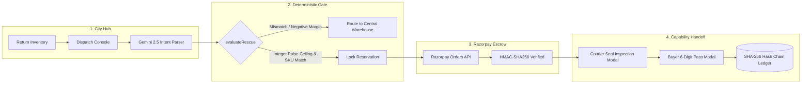

# SecondHop · Autonomous Hyperlocal Return Redirection Engine

> **Eliminating the ₹30,000 Crore E-Commerce Reverse Logistics Bleed via Hyperlocal Interception, Protected Escrow Rails, and Deterministic Agentic Handoffs.**

[](https://nextjs.org/)
[](https://www.typescriptlang.org/)
[](https://razorpay.com/)
[](https://deepmind.google/technologies/gemini/)
[](<>)
[](<>)

---

## 📌 Executive Summary

| Category | Details |
| :--- | :--- |
| **Track** | **AI Growth & Agentic Commerce** (Autonomous discovery, purchase authorization, and settlement) |
| **What It Solves** | In India, **20%–35% of e-commerce orders are returned**, draining **₹150–₹450/unit** in reverse freight, restocking, and depreciation. SecondHop intercepts factory-sealed returns at local city hubs and re-routes them to nearby verified buyers within **30–45 mins** before long-haul warehouse trucks depart. |
| **Key Innovations** | **Deterministic Safety Gate** (integer paise math, 0 LLM hallucination on money), **Zero-Trust Multi-Party Capability Tokens**, **Protected Razorpay Escrow Rail**, and **SHA-256 Hash-Chained Audit Ledger**. |
| **Test Verification** | **18 Unit Tests** + **32 Integration Checks** = **50/50 Passing** (`0 TypeScript errors`). |

---

## 🎯 What Was the Problem & What We Solved

### The Problem: The ₹30,000 Crore Interstate Return Bleed
In Indian e-commerce, **20% to 35% of all orders are returned or rejected at doorstep (RTO)**. 
Today, when a customer cancels or returns an order:
1. **The Interstate Freight Trap**: The package does not stay in the customer's city. It is moved to the city logistics hub, consolidated onto long-haul diesel trucks, and shipped **1,200+ km back to a centralized warehouse** (e.g. Bhiwandi, Bilaspur, or Hyderabad).
2. **Severe Margin Destruction**:
   - **Reverse Freight**: Costs the merchant **₹180 to ₹300 per unit**.
   - **Warehouse Quarantine**: Packaging, labor, inspection, and restocking add another **₹90 to ₹150**.
   - **Depreciation & Dead Stock**: Items sit in transit and holding queues for **10 to 14 days**, losing 15% to 35% resale value.
3. **The Absurdity**: Over **80% of consumer returns are 100% brand-new, factory-sealed boxes** (returned due to delivery delay, duplicate order, or buyer remorse). At the exact same moment, verified buyers seeking that exact product are sitting **just 3 to 5 km away** in the very same city.

```
Traditional:  Buyer A Return  ──>  Local City Hub  ──(1,200 km truck / 10 days)──>  Central Warehouse (₹350 Bleed)
SecondHop:    Buyer A Return  ──>  Local City Hub  ──(Intercept & Escrow)──>  Nearby Buyer B (30 mins / Net Profit)
```

### What We Solved: Hyperlocal Return Interception & Protected Escrow
SecondHop transforms city return consolidation hubs into **autonomous hyperlocal fulfillment nodes**:

1. **Hub Interception (Before Trucks Depart)**: We intercept factory-sealed packages during the critical 45-minute staging window at city hubs before long-haul warehouse trailers depart.
2. **Autonomous Intent & Demand Matching**: AI buyer agents and local demand signals match the exact SKU within a geofenced delivery radius (3–5 km).
3. **Deterministic Safety Gate (`evaluateRescue`)**: Zero LLM hallucination on financial calculations. The system validates:
   - Strict SKU and variant equality (no mismatched colors or models).
   - Firm integer-paise price ceilings (no floating-point rounding drift).
   - Positive merchant advantage: $(\text{Avoided Return Freight} + \text{Avoided Restock Fee} + \text{Local Price}) > (\text{Original Value} + \text{Local Courier Cost})$.
4. **Protected Multi-Party Escrow (Razorpay)**: Payment is captured and locked in protected escrow via Razorpay Orders and Webhook HMAC-SHA256 verification.
5. **Zero-Trust 2-Step Physical Verification**:
   - **Courier Seal Inspection**: The delivery partner verifies the uncompromised factory seal and barcode on-site (`S/N match`).
   - **Buyer OTP Delivery Pass**: The package is delivered to Buyer B in 30–45 minutes. Buyer B inspects the sealed box and inputs a private 6-digit delivery pass code to release the escrow funds.

**The Bottom Line**: Merchants convert a guaranteed ₹350 loss into an immediate profitable sale; buyers get brand-new, factory-sealed goods in 30 minutes at a fair discount; and long-haul diesel freight emissions are eliminated.


---

## ⚡ What Broke, and How We Got Out

| Challenge | What Broke | Engineering Solution |
| :--- | :--- | :--- |
| **1. Hub Cutoff Races** | Warehouse trucks depart on fixed 45-min rolling windows. Static cutoffs caused false rejections or checkouts racing departing trucks. | Engineered rolling cutoff evaluation (`now + etaMinutes < cutoffAt`) in `lib/rescue-service.ts` with forward-rolling active windows. |
| **2. Premature OTP Leaks** | Courier inspection could leak the buyer's 6-digit delivery pass, allowing couriers to claim delivery without inspection. | Designed **Zero-Knowledge Capability Tokens**: roles are isolated (`safeCase`), couriers only verify physical serials, and the OTP is locked until `COURIER_VERIFIED`. |
| **3. LLM Hallucinations** | Pure LLM commerce led to floating-point drift (`1099.9999`) and variant mismatches (approving Grey when Blue was requested). | Decoupled LLM from authorization: Gemini 2.5 is restricted to JSON intent extraction; all approvals pass through a **100% deterministic gate (`evaluateRescue`)** in pure integer paise. |
| **4. New-Tab Context Loss** | External tabs (`target="_blank"`) for couriers and buyers triggered popup blockers and broke operator console context. | Re-architected both into **responsive in-place modal dialogs** (`RescueHandoff`) with glowing OTP displays, backdrop dismissal, and real-time state sync. |
| **5. Replay Attacks & Idempotency** | Network retries or rapid button clicks risked duplicate Razorpay orders or double-claiming packages. | Bound checkouts to unique `requestId`s, validated transitions against an **append-only SHA-256 hash-chained ledger**, and enforced HTTP 409 conflict checks. |

---

## 🏗️ Technical Architecture



### Core Tech Stack

- **Frontend & Runtime**: Next.js 15 (App Router, Server Components), TypeScript 5.8, Tailwind CSS.
- **Payment & Escrow**: Razorpay Orders API, Auto-Capture, and Webhook HMAC-SHA256 signature verification.
- **AI Intent Engine**: Google Gemini 2.5 Flash with strict JSON Schema constraints & regex fallbacks.
- **Data & Ledger**: SQLite / Cloudflare D1 with Drizzle ORM + SHA-256 cryptographic audit chaining.
- **Test Harness**: Node.js test runner (`node --test`), 18 unit tests + 32 integration scenarios.

---

## 📦 Verified 17-Product Hub Inventory

Full catalog across 5 categories with real-time margin calculations:
- **Audio**: SoundWave WH40 (Midnight Blue / Stone Grey), Sony WH-1000XM5, AirPods Pro 2, Bose QuietComfort Ultra, Nothing Ear (2).
- **Smartphones & Cameras**: iPhone 16 Pro Max, Galaxy S24 Ultra, Pixel 9 Pro, DJI Osmo Pocket 3, Fujifilm X100VI.
- **Computing & Wearables**: Galaxy Watch 6 LTE, iPad Air M2, Kindle Paperwhite, MX Master 3S, Keychron K2 Pro.

---

## 🧪 Verification & Automated Tests

```bash
# Run unit tests (18 tests covering economics, invariant boundaries, & safety gates)
npm test

# Run multi-party integration harness (32 checks covering replay, escrow, & OTP security)
node scripts/verify-rescue.mjs

# Run TypeScript compilation check (0 errors)
npx tsc --noEmit
```

---

## 🚀 Quickstart

```bash
# 1. Clone repository
git clone https://github.com/Vedag812/SecondHop.git
cd SecondHop

# 2. Install dependencies
npm install

# 3. Setup environment (.env.local)
cp .env.example .env.local
# Set RAZORPAY_KEY_ID, RAZORPAY_KEY_SECRET, and GEMINI_API_KEY (optional for mock)

# 4. Start development server
npm run dev
```

Open **[http://localhost:3000/dashboard](http://localhost:3000/dashboard)** to launch the Dispatch Console.

---

## 📄 License

MIT License · Built for the **Razorpay Buildathon 2026** by **[Vedant Agarwal](https://github.com/Vedag812)** (`Vedag812`).
